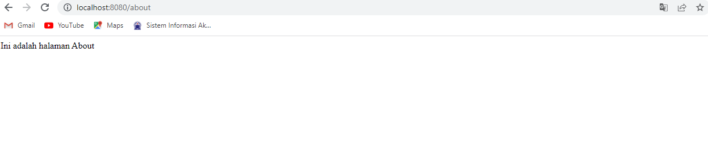
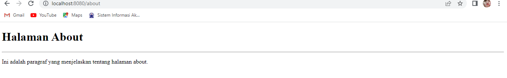
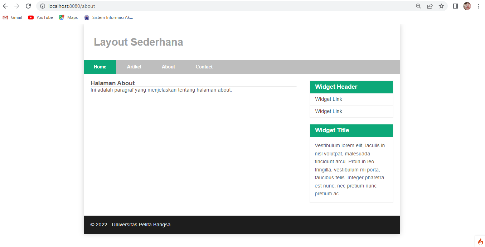
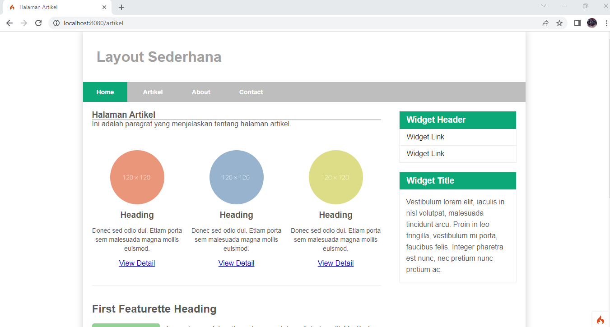
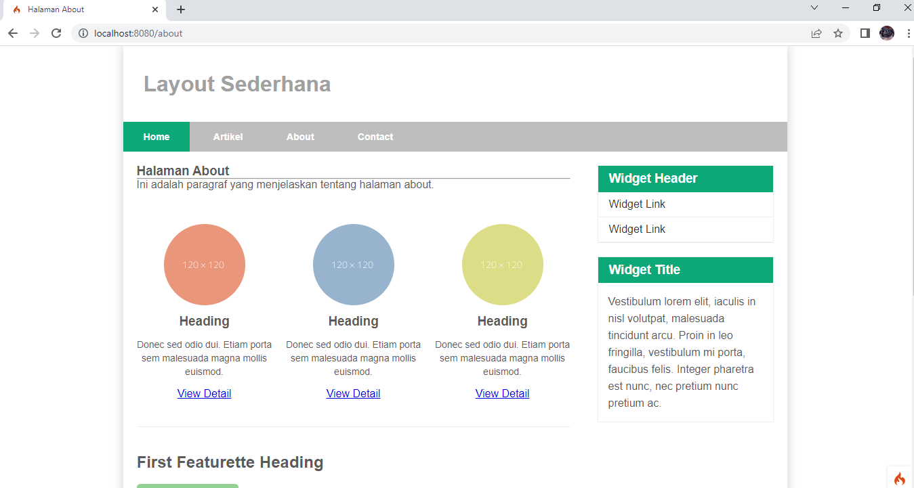

# PRAKTIKUM 11

**Nama : Reka Hani Latifah Nurhasanah** <br>

**Nim : 312010343** <br>

**Kelas : TI.20.A2** <br>

**Matkul : Pemrograman Web** <br>

### Menjalankan Server

1. Buka CMD lalu arahkan ke

`cd/xampp/htdocs/lab11_php_ci/Lab11_php_ci/ci4`

2. Kemudian jalankan server milik codeignier 4

`php spark serve`

3. Buka chrome tulis di URL nya

`localhost:8080`

### ci4

1. Routes

```
$routes->get('/', 'Home::index');
$routes->get('/about', 'Page::about');
$routes->get('/contact', 'Page::contact');
$routes->get('/faqs', 'Page::faqs');
```

2. Controller

```
<?php

namespace App\Controllers;

class Page extends BaseController
{
    public function about()
    {
       echo "Ini adalah halaman About";

    }

    public function contact()
    {
        echo "Ini adalah halaman Contact";

    }

    public function faqs()
    {
        echo "Ini adalah halaman Faqs";
    }
}
```

Akses pada halaman url http://localhost:8080/about



3.  View

```
<!DOCTYPE html>
<html lang="en">
<head>
    <meta charset="UTF-8">
    <title><?= $title; ?></title>
</head>
<body>
    <h1><?= $title; ?></h1>
    <hr>
    <p><?= $content; ?></p>
</body>
</html>
```

Ubah method about pada class Controllers Page menjadi seperti berikut 

```
public function about()
    {
        return view('about', [
            'title' => 'Halaman About', 
            'content' => 'Ini adalah paragraf yang menjelaskan tentang halaman about.'
        ]);
    }

```

Setelah halaman di refresh makan akan menjadi seperti berikut



4. Membuat Layout dengan CSS

```
/* RESET CSS*/
* {
    margin: 0;
    padding: 0;
}

body {
    line-height: 1;
    font-size: 100%;
    font-family: 'Open Sans', sans-serif;
    color: #5a5a5a;
}

#container {
    width: 980px;
    margin: 0 auto;
    box-shadow: 0 0 1em #ccc;
}

/* HEADER*/
header {
    padding: 20px;
}

header h1 {
    margin: 20px 10px;
    color: #a0a0a0;
}

/* NAV */
nav {
    display: block;
    background-color: #bebebe;
}

nav a {
    padding: 15px 30px;
    display: inline-block;
    color: #fff;
    font-size: 14px;
    text-decoration: none;
    font-weight: bold;
}

nav a.active,
nav a:hover {
    background-color: #0ca878;
}

/* HERO PANEL */
#hero {
    background-color: #e4e4e5;
    padding: 50px 20px;
    margin-bottom: 20px;
}

#hero h1 {
    margin-bottom: 20px;
    font-size: 35px;
}

#hero p {
    margin-bottom: 20px;
    font-size: 18px;
    line-height: 25px;
}

/* MAIN CONTENT */
#wrapper {
    margin: 0;
}

#main {
    padding-top: 25px;
    float: left;
    width: 640px;
    padding: 20px;
}

.row {
    padding-top: 50px;
}

.divider {
    border: 0;
    border-top: 1px solid #eee;
    margin: 40px 0;
}

/* ENTRY */
.entry {
    margin: 15px 0px;
}

.entry h2 {
    margin-bottom: 20px;
}

.entry p {
    line-height: 25px;
}

.entry img {
    float: left;
    border-radius: 5px;
    margin-right: 15px;
}

.entry .right-img {
    float: right;
    margin-left: 15px;
}

/* SIDEBAR AREA */
#sidebar {
    float: right;
    width: 260px;
    padding: 20px;
}

/* WIDGET */
.widget-box {
    border: 1px solid #eee;
    margin-bottom: 20px;
}

.widget-box .title {
    padding: 10px 16px;
    background-color: #0ca878;
    color: #fff;
}

.widget-box ul {
    list-style-type: none;
}

.widget-box li {
    border-bottom: 1px solid #eee;
}

.widget-box li a {
    padding: 10px 16px;
    color: #333;
    display: block;
    text-decoration: none;
}

.widget-box list-style:hover a {
    background-color: #eee;
}

.widget-box p {
    padding: 15px;
    line-height: 25px;
}

/* FOOTER */
footer {
    clear: both;
    background-color: #1d1d1d;
    padding: 20px;
    color: #eee;
}

/* BOX */
.box {
    display: block;
    float: left;
    width: 33.333333%;
    box-sizing: border-box;
    -moz-box-sizing: border-box;
    -webkit-box-sizing: border-box;
    padding: 0px 10px;
    text-align: center;
}

.box h3 {
    margin: 15px 0px;
}

.box p {
    line-height: 20px;
    font-size: 14px;
    margin-bottom: 15px;
}

.box img {
    border: 0;
    vertical-align: middle;

}

.image-circle {
    border-radius: 50%;
}

.row {
    margin: 0 -10px;
    box-sizing: border-box;
    -moz-box-sizing: border-box;
    -webkit-box-sizing: border-box;
}

.row:after, .row:before,
.entry:after, .entry:before {
 content:'';
 display:table;
}
.row:after,
.entry:after {
 clear:both;
}
```

5. Header

```
<!DOCTYPE html>
<html lang="en">
<head>
    <meta charset="UTF-8">
    <title><?= $title; ?></title>
    <link rel="stylesheet" href="<?= base_url('/style.css');?>">
</head>
<body>
    <div id="container">
    <header>
        <h1>Layout Sederhana</h1>
    </header>
    <nav>
        <a href="<?= base_url('/');?>" class="active">Home</a>
        <a href="<?= base_url('/artikel');?>">Artikel</a>
        <a href="<?= base_url('/about');?>">About</a>
        <a href="<?= base_url('/contact');?>">Contact</a>      
    </nav>
    <section id="wrapper">
        <section id="main">
        
```

6. Footer

```
            </section>
            <aside id="sidebar">
                <div class="widget-box">
                    <h3 class="title">Widget Header</h3>
                    <ul>
                        <li><a href="#">Widget Link</a></li>
                        <li><a href="#">Widget Link</a></li>
                    </ul>
                </div>
                <div class="widget-box">
                    <h3 class="title">Widget Title</h3>
                    <p>Vestibulum lorem elit, iaculis in nisl volutpat, malesuada 
                        tincidunt arcu. Proin in leo fringilla, vestibulum mi porta, faucibus felis. 
                        Integer pharetra est nunc, nec pretium nunc pretium ac.</p>
                </div>
            </aside>
        </section>
        <footer>
            <p>&copy; 2022 - Universitas Pelita Bangsa</p>
        </footer>
    </div>
</body>
</html>
```
7. About

```
<!DOCTYPE html>
<html lang="en">
<head>
    <meta charset="UTF-8">
    <title><?= $title; ?></title>
</head>
<body>
    <?= $this->include('template/header'); ?>

    <h1><?= $title; ?></h1>
    <hr>
    <p><?= $content; ?></p>

    <?= $this->include('template/footer'); ?>
</body>
</html>      
```

Tampilan halaman setelah di refresh



### Pertanyaan dan Tugas

Lengkapi kode program untuk menu lainnya yang ada pada Controllers Page, sehingga semua link pada navigasi header dapat menampilkan tampilan dengan layout yang sama

1. Controllers Page

```
<?php

namespace App\Controllers;

class Page extends BaseController
{
    public function about()
    {
        return view('about', [
            'title' => 'Halaman About', 
            'content' => 'Ini adalah paragraf yang menjelaskan tentang halaman about.'
        ]);
    }

    public function artikel()
    {
        return view('artikel', [
            'title' => 'Halaman Artikel', 
            'content' => 'Ini adalah paragraf yang menjelaskan tentang halaman artikel.'
        ]);
    }

    public function contact()
    {
        return view('contact', [
            'title' => 'Halaman Contact', 
            'content' => 'Ini adalah paragraf yang menjelaskan tentang halaman contact.'
        ]);
    }

    public function faqs()
    {
        echo "Ini adalah halaman Faqs";
    }

    public function tos()
    {
        echo "Ini adalah Terms of Services";
    }
}
```

2. Controllers Home

```<?php

namespace App\Controllers;

class Home extends BaseController
{
    public function home()
    {
        return view('home', [
            'title' => 'Halaman Home', 
            'content' => 'Ini adalah paragraf yang menjelaskan tentang halaman home.'
        ]);
    }
}
```

3. File Artikel

```
<!DOCTYPE html>
<html lang="en">
<head>
    <meta charset="UTF-8">
    <title><?= $title; ?></title>
</head>
<body>
    <?= $this->include('template/header'); ?>

    <h1><?= $title; ?></h1>
    <hr>
    <p><?= $content; ?></p>

    <?= $this->include('template/footer'); ?>
</body>
</html>    
```

4. File Contact

```
<!DOCTYPE html>
<html lang="en">
<head>
    <meta charset="UTF-8">
    <title><?= $title; ?></title>
</head>
<body>
    <?= $this->include('template/header'); ?>

    <h1><?= $title; ?></h1>
    <hr>
    <p><?= $content; ?></p>

    <?= $this->include('template/footer'); ?>
</body>
</html>    
```

5. File home

```
<!DOCTYPE html>
<html lang="en">
<head>
    <meta charset="UTF-8">
    <title><?= $title; ?></title>
</head>
<body>
    <?= $this->include('template/header'); ?>

    <h1><?= $title; ?></h1>
    <hr>
    <p><?= $content; ?></p>

    <?= $this->include('template/footer'); ?>
</body>
</html>    
```

6. Isi Footer

```
                <div class="row">
                    <div class="box">
                        
                        <h3>Heading</h3>
                        <p>Donec sed odio dui. Etiam porta sem malesuada magna mollis 
                            euismod.</p>
                        <a href="#" class="btn btn-default">View Detail</a>
                    </div>
                    <div class="box">
                        
                        <h3>Heading</h3>
                        <p>Donec sed odio dui. Etiam porta sem malesuada magna mollis 
                            euismod.</p>
                        <a href="#" class="btn btn-default">View Detail</a>
                    </div>
                    <div class="box">
                        
                        <h3>Heading</h3>
                        <p>Donec sed odio dui. Etiam porta sem malesuada magna mollis 
                            euismod.</p>
                        <a href="#" class="btn btn-default">View Detail</a>
                    </div> 
                </div>
                <hr class="divider">
                    <article class="entry">
                        <h2>First Featurette Heading</h2>
                        
                        <p>Lorem ipsum dolor sit amet, consectetur adipiscing elit. Vestibulum lorem 
                            elit, iaculis in nisl volutpat, malesuada tincidunt arcu. Proin in leo fringilla, 
                            vestibulum mi porta, faucibus felis. Integer pharetra est nunc, nec pretium nunc 
                            pretium ac.</p>
                    </article>
                <hr class="divider">
                    <article class="entry">
                        <h2>First Featurette Heading</h2>
                        
                        <p>Lorem ipsum dolor sit amet, consectetur adipiscing elit. Vestibulum lorem 
                            elit, iaculis in nisl volutpat, malesuada tincidunt arcu. Proin in leo fringilla, 
                            vestibulum mi porta, faucibus felis. Integer pharetra est nunc, nec pretium nunc 
                            pretium ac.</p>
                    </article>  
```
7. Mengubah Nav pada Header

```
    <nav>
        <a href="<?= base_url('/home');?>" class="active">Home</a>
        <a href="<?= base_url('/artikel');?>">Artikel</a>
        <a href="<?= base_url('/about');?>">About</a>
        <a href="<?= base_url('/contact');?>">Contact</a>      
    </nav>   
```

8. Menambahkan Router

```
$routes->get('/', 'Home::home');
$routes->get('/home', 'Home::home');
$routes->get('/artikel', 'Page::artikel');
```

Refresh halaman maka halaman utama akan seperti berikut 

Tampilan Home


Tampilan Artikel



Tampilan About



Tampilan Contact

